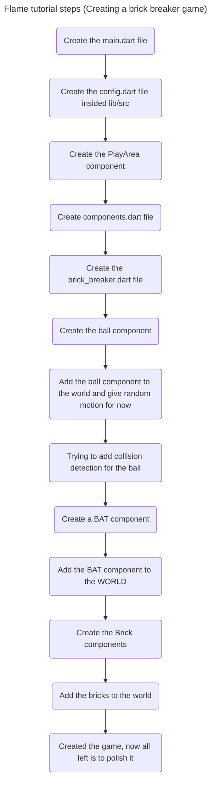

# Notes
- Where Flutter has `Widgets`, Flame has `Components`. Where Flutter apps consist of creating trees of widgets, Flame games consist of maintaining trees of components.
- The background/PlayArea is a `RectangleComponent` and the Ball is a `CircleComponent`
- For collision -> First, the code tests if the `Ball` collided with `PlayArea`. This seems redundant for now, as there are no other components in the game world. That will change in the next step, when you add a bat to the world. Then, it also adds an else condition to handle when the ball collides with things that aren't the bat. A gentle reminder to implement remaining logic, if you will.
- Cuurently a fixed number of bricks are produced
- Every component has a `CollisionCallbacks` for collisions and `HasGameReference<BrickBreaker>` for referencing to the PlayArea