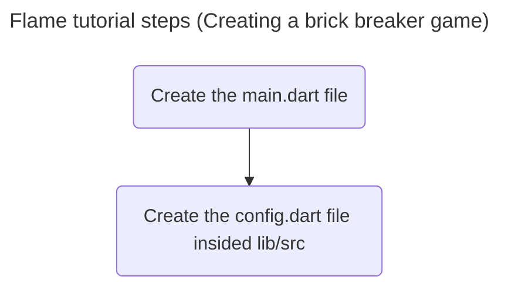

```mermaid
---
title: Flame tutorial steps (Creating a brick breaker game)
---
flowchart TD
    id1(Create the main.dart file)
    id2(Create the config.dart file insided lib/src)

    id1 --> id2

```