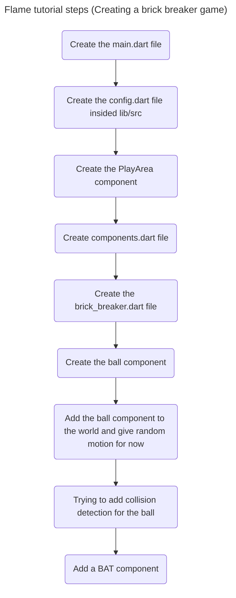

# Notes
- Where Flutter has `Widgets`, Flame has `Components`. Where Flutter apps consist of creating trees of widgets, Flame games consist of maintaining trees of components.
- The background/PlayArea is a `RectangleComponent` and the Ball is a `CircleComponent